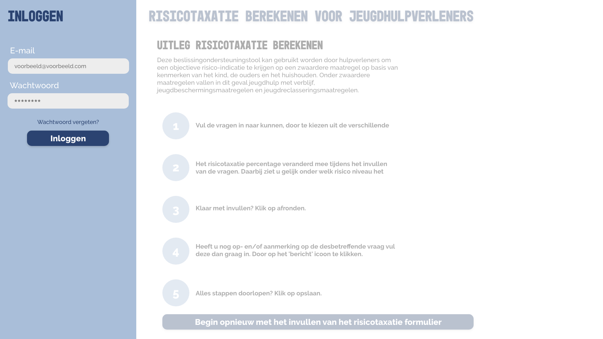
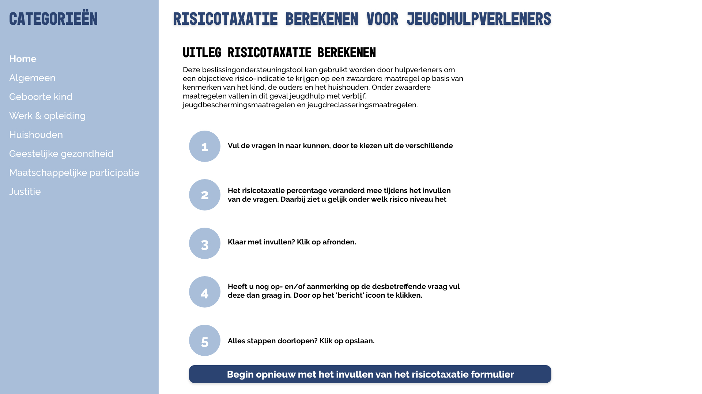
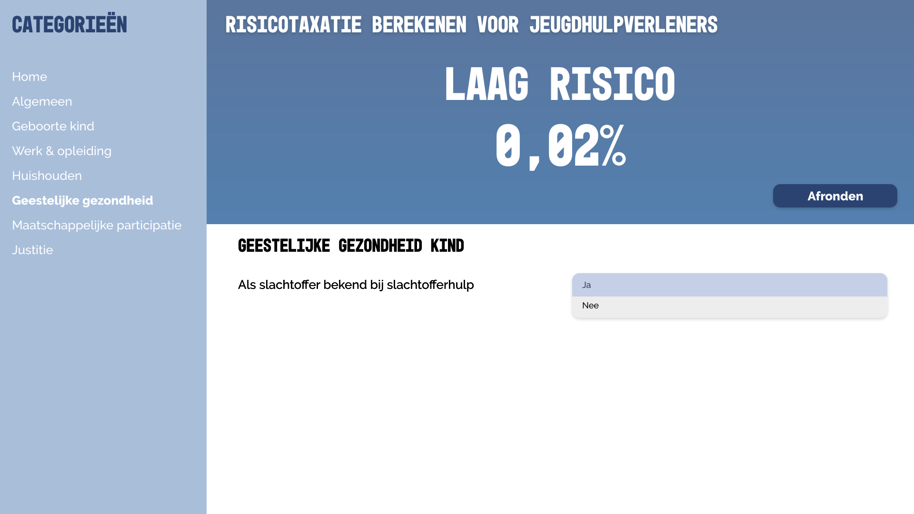
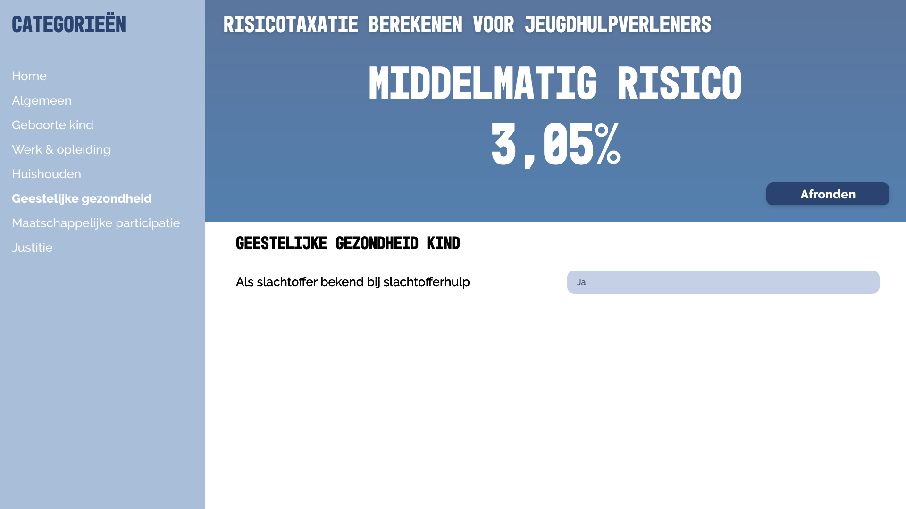
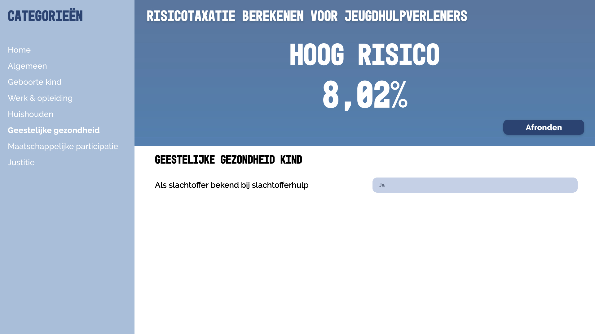
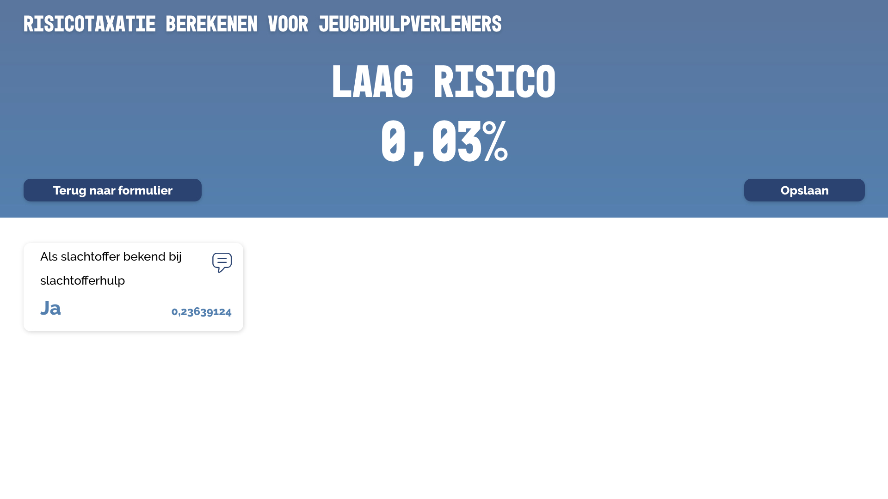
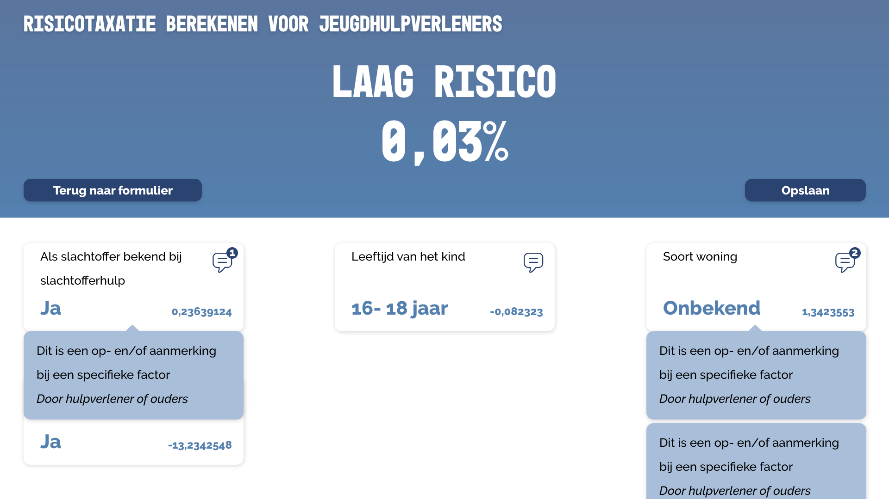

# Risk Assessment App
###### In this application the risk of out-of-home-placement will be calculated as an auxiliary tool for youth-workers.


## How to install
Before installing make sure you have installed the latest version of node.js
Choose or make a new directory.
Load the template into your directory.
```bash
git clone https://github.com/chelseadoeleman/polymer.git
```

Make sure you have the latest version of npm.
Install the dependencies in [package.json](package.json)
```bash
npm install
```

Start the server 
```bash
npm start
```

## Concept

The "Risicotaxatie berekenen" application is an application for youth workers to serve as an secondary tool to help them make the decision of out-of-home-placement for children in Amsterdam. There are still a lot of children at risk at home and in the end youth workers resolve to place them out of their home for their own safety. The decision to do this is often obscured by biases of youth workers. The goal here is to have less cases that result to out-of-home-placement.

The application contains different questions about the child in concern. Regarding education, household, parents, etc. Each factor weighs differently when calculating the risk assessment. In the application the risk assessment will be calculated real-time to get a fast indication on how severe a case might be.  

First you have a login page. The page is accessable to youth workers and parents, to solve the tranparancy problem.



Then you get to the explanation page




For every specific categorie there are different questions that need to answered. These question can have a have a certain value that are influenced by different factors. 




When a risk assessment poses a warning the text above the risk assessment percentage will change and tell you wether this case migth propose a high risk or no risk at all.





In the end the user gets to see all the different factors the risk assessment percentage is influenced by. And can add comments to explain certain factors or comment or why they think it shouldn't influence the percentage, because of certain circumstances. The youth worker can also add comments for parents, to give them better insight into their research.





## Learning process

#### Day 1 | 8 October 2018
Today we had the kick-off. Which started off with a presentation by Titus and Laurens about Tech Track. Then Arjan came by from Garage 2020 to tell us about out-of-home-placement in Amsterdam. Nearly 2000 kids are anually placed out of home. Because the circumstances at home become a risk to them. Arjan already build an app in R, but likes to take this concept further. He also wants a more user friendly interface.

#### Day 2 | 9 October 2018
In the morning we had three guest lectures about different frameworks, so we could get a better understanding of javascript frameworks and the differences between these frameworks. The first presentation was about React.js, then about Vue.js and lastly Angular. Around midday we did some research about different javascript frameworks. This research gave more insight in the different languages that come with different frameworks and all their possibilities. By the end of the day we had to deliver our top three framework choices.

#### Day 3 Polymer | 10 October 2018
Arjan came by again to give us more insight into the working field and when youth workers might actually want to use the application in their working process.

Polymer is a framework by google, which indicates that is probably kept up-to-date. That's why I thought it would be a good framework to work with. In total there are three different versions published by Polymer. I've decided to work with Polymer 3.0, the newest version until now.

The documentation is kept up-to-date by Polymer and it can be found for every version. However troubleshooting is troublesome, because there aren't many people who have worked with Polymer. Even on Stackoverflow there is not a lot to go on, however there are some topics related to Polymer.

Together with three other classmates we are building the risk assessment application with Polymer. The documentation was a bit though to go through, but that is probably because it's a new framework I had to learn.

The first day I've looked up tutorials, so I could get started. Eventually we found a boilerplate to set up Polymer. From there on I did a lot of research to understand the code and searched for all the different possibilities within the framework.

#### Day 4 Polymer | 11 October 2018
Today I've looked further into the documentation. Followed another beginners tutorial which made it a lot clearer for me. I have learned how to create properties and how to pass them through components. For me it was also important to structure my code. So I have a map with all the pages and a map with the different components, which will be included in the pages. With larger applications you might also want to work with different structures within your components map, like the [atomic design](http://bradfrost.com/blog/post/atomic-web-design/) methodology. One of the reasons you might want to resolve to using a framework is, because it allows you to use a component multiple times within your application, without writing the same code over and over again.

In Polymer they use inline CSS in a HTML template. Which can be accessed through:

```js
static get template {
    return html `
    <style include="shared-styles">
    </style>

    <h1>Hello World</h1>

    `
  }
```
I find this very confusing and honestly bad practice when coding. It also make the readability of your code a lot more difficult. It is possible to include a standard style file, in which i've done most of my styling. But when writing CSS in a component it overwrites the included style file. This makes styling per component easier, but in the long run this can be very annoying.

#### Day 5 Polymer | 12 October 2018
Today I have been working on my routing and on my HTML forms. And to put everything in different components and including it in the pages. I've also worked on my concept because in the end the end-result is also what counts, because it is probably not possible finish the whole application within the time span. In the end I didn't get very far with my forms, because I was thinking more about component structure. However with Polymer, mounting components with different properties, is not an easy task and would take up a lot of time.

#### Day 6 Polymer | 15 October 2018
Another day of working on my HTML forms. And trying to tackle the styles...
The forms took up more time than i originally had imagined. I also had to make the decision of not having a form on one page. Because making tabs would probably take up too much time, so in the end I divided my form into different categories on different pages.

I've also worked on my concept again because of the presentations in the morning, which gave me very useful insights into the problem. It was also very interesting to hear what their working process looked like and wether they would like to have a digital tool to help them make, sometimes tough, choices. And the tool could also serve as an unbiased to help youth workers. However not all of their wishes are possible to realize before Friday, but can definitely be included in my sketches.

#### Day 7 Polymer | 16 October 2018
CSS is an absolute nightmare in Polymer. Because I've used a boilerplate it is not possible to style all elements, by just calling them by their classname or id. This is because of the shadowRoot. which is included on several HTML elements. By using `--` before an element it is possible to access those, but you have to go through every layer before you get to your specific element. And you have to use it in that specific component/page. Together with [Maikel](https://github.com/Maikxx/polymer) we've worked on pushing our HTML form values into to the local storage. This took up a lot our time and for me to mostly understand the code, but in the end it worked! Then I got to explain my code to Linda which gave me an even better understanding about the code.

We have created functions that go into a different map called helpers, because these are functions that needed to be used multiple times in different components. In this case we do not write double code.

#### Day 8 Polymer | 17 October 2018
In the morning we had a guest lecture by Nienke about why you would want to use a framework. I found this lecture first of all very interesting and second of all also entertaining.

On another note this day we have found out it is not possible to use states in Polymer... And actually kinda defeats the whole purpose of using a framework. Definitely not something you want to find out on one of the last day's we get to work on this project. It is probably possible, because you had states in earlier versions of Polymer, but alas there wasn't enough documentation nor community support to help us out at this point. Now we've decided to write everything to the LocalStorage. Together with Maikel we've implemented the risk assessment formula in the app. I've found this the most difficult part of the whole process to understand. Thanks to Maikel we have a working risk assessment calculator.

#### Day 9 Polymer | 18 October 2018
Today was mostly making sure the Risk Assessment worked on every component and updated real time. On the way I ran into a lot of different errors, but in the end I resolved all of them. In the morning I've mostly tried to explain the risk assessment calculator to Linda and Jessie, so I could make sure I understood the code better than I did before. Around midday I have spent time into my documentation and styling. 

## License
This repository is licensed as [MIT](license) by [Chelsea Doeleman](https://github.com/chelseadoeleman), 2018

